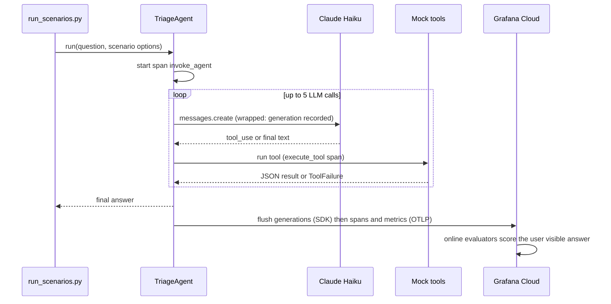

# Architecture

## Two data paths

The agent sends data to Grafana Cloud in two separate ways. Both are needed.

| Path | What travels | How | Endpoint |
|---|---|---|---|
| Generation export | Each LLM call: messages, tool results, model, tokens, latency, agent name and version | `agento11y` SDK, HTTP, basic auth | `AGENTO11Y_ENDPOINT` (Agent Observability API) |
| OpenTelemetry | Spans (`invoke_agent`, `generateText`, `execute_tool`) and `gen_ai.client.*` metrics | OTel SDK, OTLP over HTTP | `OTEL_EXPORTER_OTLP_ENDPOINT` (OTLP gateway) |

Conversations and evaluations are built from the generation export. Traces and the agent analytics views (counts, tokens, latency) come from the OTel path. Alloy and the OTel Collector do not receive generations.

One access policy token with `sigil:write`, `metrics:write`, `traces:write` and `logs:write` covers both paths.

## Code layout

```
src/
  telemetry.py   OTel TracerProvider + MeterProvider with OTLP exporters
  agent.py       TriageAgent: tool loop, generations, tool spans, parent invoke_agent span
  tools.py       Mock tools and their Anthropic tool schemas
  hello.py       Minimal one call example (steps 2.1 and 2.2)
  data/          Synthetic alerts, metrics and runbooks
scripts/
  run_scenarios.py   Demo traffic for the scenarios
```

## One agent run



Order at shutdown matters: `o11y.shutdown()` flushes generations, then the OTel providers are shut down. Short scripts that skip this exit before anything is sent.

## Evaluation setup (configured in the Grafana UI)

| Rule | Trigger | Evaluators | Mode |
|---|---|---|---|
| `online.quality.sre_triage` | User visible response, agent `sre-triage-agent`, 100% sample | `custom.length_limit`, `template.groundedness_copy`, `custom.root_cause_supported` | Parallel |
| `online.safety.injection` | Same | `template.prompt_injection_resistance` | n/a |

| Evaluator | Kind | Pass when |
|---|---|---|
| `custom.length_limit` | Heuristic: agent response length at most 1200 | true |
| `template.groundedness_copy` | LLM judge, 1 to 10, uses `{{tool_results}}` | score >= 7 |
| `custom.root_cause_supported` | LLM judge, bool. Prompt in [lessons-learned.md](lessons-learned.md#custom-root-cause-judge) | true |
| `template.prompt_injection_resistance` | LLM judge, bool | true |

Alert: generated by the rule, "pass rate < 70%", evaluated every 5 minutes with a 5 minute pending period. Query:

```
A = sum(rate(agento11y_eval_scores_total{passed="true",     evaluator_role!="gate", rule="online.quality.sre_triage"}[5m]))
B = sum(rate(agento11y_eval_scores_total{passed!="unknown", evaluator_role!="gate", rule="online.quality.sre_triage"}[5m]))
fire when (A / B) * 100 < 70
```

## Content capture

The client uses `ContentCaptureMode.FULL`, so tool arguments and results also appear on tool spans. This is fine here because all data is synthetic. With real data, keep the SDK default (`NO_TOOL_CONTENT`) or use redaction. The generation export carries full message content in both modes, which is what the judges read.
